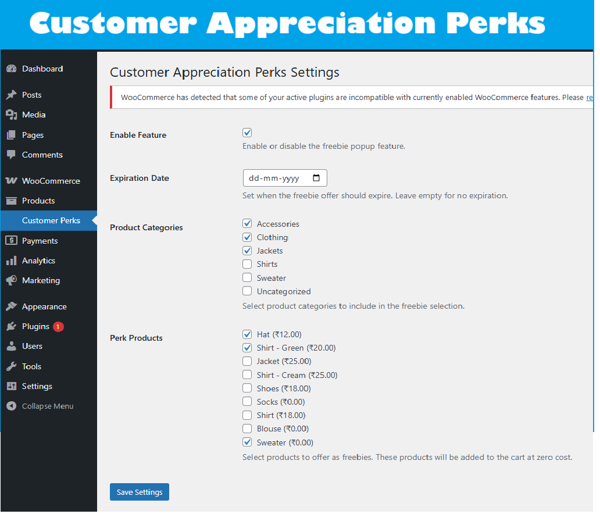

# Customer Appreciation Perks

Enhance your WooCommerce checkout with a beautiful, branded "Choose Your Perk" popup! Reward your customers with a free gift (perk) of their choice, boosting loyalty and delighting shoppers.

---

## Features

- **Modern Popup Experience:**  
  A sleek, responsive popup appears on the checkout page, inviting users to select a complimentary perk from a curated collection.

- **Grid Slider (Carousel):**  
  Perks are displayed in a visually appealing, swipeable grid slider (powered by Swiper.js), ensuring a smooth experience even with many products.

- **One-Click Perk Selection:**  
  Customers can add their chosen perk to the cart with a single click.

- **Remove & Re-choose:**  
  If a customer changes their mind, they can remove the perk directly from the checkout summary and pick a new one.

- **Admin Controls:**  
  - Enable/disable the perk popup.
  - Set an expiration date for the offer.
  - Select eligible product categories and specific perk products.
  - All settings are easily managed from the WordPress admin.

- **Seamless WooCommerce Integration:**  
  - Perks are added to the cart at zero cost.
  - Popup only appears if the customer hasn't already chosen a perk.
  - Fully compatible with WooCommerce's checkout flow.

---

## Screenshots

1. **Checkout Perk Popup:**  
   
2. **Responsive Grid Slider:**  
   
3. **Remove Perk Option:**  
   
4. **Admin Settings Page:**  
   

---

## Installation

1. Upload the plugin files to the `/wp-content/plugins/woo-cmitcap` directory, or install via the WordPress plugins screen.
2. Activate the plugin through the 'Plugins' screen in WordPress.
3. Configure your perks in the 'Customer Perks' admin menu.

---

## FAQ

**Q: Can I choose which products to offer as perks?**  
A: Yes! Select any WooCommerce product as a perk from the settings page.

**Q: Can customers change their perk?**  
A: Absolutely. They can remove their perk at checkout and pick a new one.

**Q: Is the popup mobile-friendly?**  
A: Yes, the popup and slider are fully responsive.

---

## Changelog

**1.0**  
- Initial release with grid slider, admin controls, and seamless WooCommerce integration. 